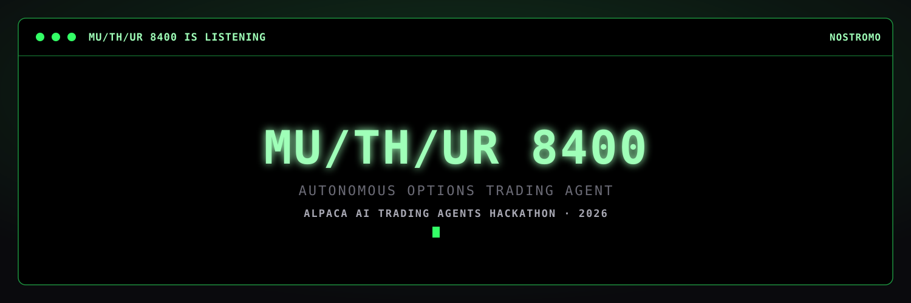
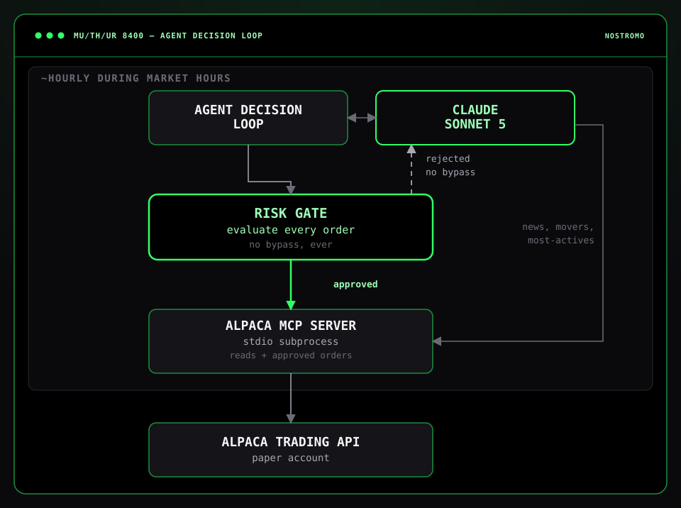
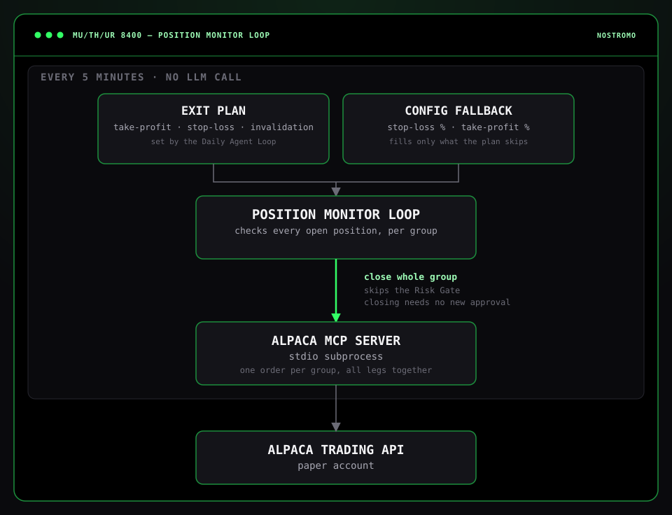
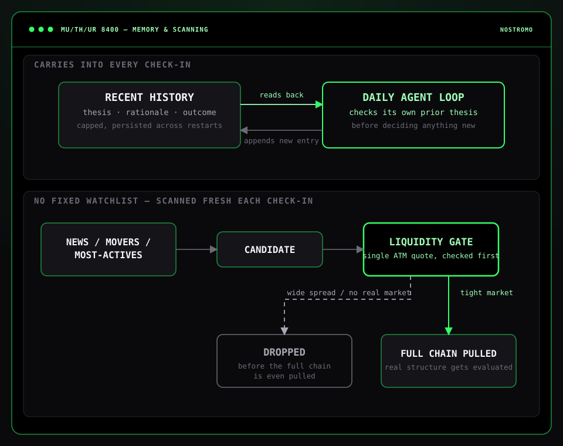
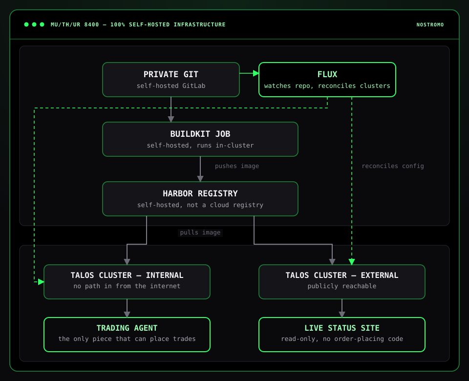

 

**Built for the [Alpaca AI Trading Agents Hackathon](https://lablab.ai/ai-hackathons/alpaca-ai-trading-agents-hackathon) — Aug 28 – Sep 4, 2026**

📄 **[Read the one-page write-up →](WRITEUP.md)** — AI logic, risk gates, Alpaca infrastructure implementation, and lessons learned

Pre-event work disclosure: the agent's core logic, risk gates, and MCP integration, along with the
self-hosted pipeline it deploys through, were built starting Aug 25, ahead of the official Aug 28
kickoff — permitted under the hackathon's rules. All live trading ran during the official window,
from a dedicated $100,000 paper account created for the contest, starting Monday, Aug 31 at 9:30 a.m. ET.

## Table of Contents

- [The Idea](#the-idea)
- [Daily Agent Loop](#daily-agent-loop)
- [Position Monitor](#position-monitor)
- [Risk Gates](#risk-gates)
- [Memory & Scanning](#memory--scanning)
- [Live Status Site](#live-status-site)
- [Alpaca Infrastructure](#alpaca-infrastructure)
- [Self-Hosted Infrastructure](#self-hosted-infrastructure)
- [Secrets Management](#secrets-management)
- [The Code](#the-code)
- [Tech Stack](#tech-stack)
- [Inspiration](#inspiration)

## The Idea

MU/TH/UR 8400 funds the Nostromo's operations by trading options.

Every cycle it reviews the market and its open positions and decides what to do next. Before it
acts, it has to record:

- **Thesis** — what's the actual idea, and what's the evidence for it?
- **Entry rationale** — why this structure and strike, not just the direction?
- **Invalidation** — what would prove it wrong?

That record carries forward. The next cycle reads it back before deciding whether a position still
makes sense, instead of judging it fresh with no memory of the reasoning that opened it. A trade
with no invalidation condition doesn't count as a real plan.

## Daily Agent Loop

At the 45 minute mark of each trading hour — the only loop that calls Claude. Each cycle it scans
news, movers, and most-actives, then decides whether to open, close, or adjust a position. Before it
acts, it has to write down a thesis: why this specific option structure, and what would prove it
wrong. That reasoning carries forward, so the next cycle checks its own thesis instead of judging
the position fresh with no memory of why it was opened.

Opening a position also means setting its own exit plan — a take-profit and a stop-loss level, in
its own words, not a generic percentage. That plan is what the Position Monitor enforces between
check-ins.

## Position Monitor

Every 5 minutes — no LLM call, no waiting for the next check-in. It watches every open position
against the exit plan the Daily Agent Loop set for it (falling back to a fixed stop-loss/
take-profit percentage if the plan didn't specify one) and closes the position the instant a
threshold is crossed, rather than leaving it exposed for up to another hour.

## Risk Gates

A risk gate is a hardcoded checkpoint every order passes through before it reaches Alpaca — plain
Python, not a prompt instruction, so there's no way for Claude to talk its way past it. It either
approves the order or rejects it with a reason; nothing in between.

Only three trade shapes are legal:

- Long call or put
- Debit vertical spread
- Credit vertical spread

Any short leg must be matched by a long leg on the same underlying, expiration, and right, of at
least equal size — an uncovered short of any kind is rejected outright, regardless of framing.
Passing on a check-in with no trade at all is always a valid fourth outcome.

Beyond that structural check, the gate also enforces fixed portfolio limits:

| Limit | Value |
|---|---|
| Max risk per trade | 3% of equity per position |
| Max options exposure | 35% of equity in open options positions at once |
| Max concurrent positions | 5 open at a time |
| Max daily loss | 7% drawdown halts new entries for the rest of the day |

## Memory & Scanning

- **Remembers its own reasoning.** A capped, persisted log of past check-ins — thesis, rationale,
  outcome — carries into every cycle.
- **No fixed watchlist.** Each check-in scans news, movers, and most-actives for candidates. A
  single at-the-money quote is enough to drop one — a wide spread or no real market rules a name
  out before its full options chain is even pulled.

## Live Status Site

Nothing on it is staged. It streams the agent's real account and position data over Server-Sent
Events, and replays its actual decision-log entries as they're written. Every trading day also
gets its own permanent archive page, linked from a nav under the live view — a short written
wrap-up of what happened and why sits at the top, and below it that day's full decision log is
replayed as its own set of terminal windows. The frontend ships via a ConfigMap instead of a
rebuild, so a UI change goes live within seconds of a commit.

## Alpaca Infrastructure

Every account read, market-data lookup, and order placement goes through
[Alpaca's own MCP server](https://github.com/alpacahq/alpaca-mcp-server), run as a local
subprocess — Claude never calls Alpaca's REST API directly. The server's tools are handed to
Claude as-is; when the model decides to check buying power, pull an options chain, or place an
order, that tool call routes straight through the MCP session with no hand-rolled API wrapper in
between.

Tool names aren't hardcoded against one API version — they're discovered from the server's own
tool list at connect time and matched by keyword, so the integration keeps working if Alpaca
renames or adds tools upstream. The order-placing tool is exactly where the Risk Gate intercepts:
an order call goes through the same MCP surface as every other tool call, it just never reaches
Alpaca without clearing the gate first. The Position Monitor loop shares this same MCP connection
for reading live prices and closing positions, rather than a second, separate integration.

Runs entirely against Alpaca's paper trading environment.

## Self-Hosted Infrastructure

Both the agent and the status site run entirely on **self-hosted** infrastructure — no cloud CI,
no cloud registry, no managed Kubernetes:

- **Self-hosted build pipeline.** A commit to the self-hosted GitLab repo triggers an in-cluster
  BuildKit job that pushes the image to a self-hosted Harbor registry; Flux watches the same repo
  and reconciles the change onto the cluster.
- **Two clusters, split by trust.** The agent — the only piece that can place trades — runs on an
  internal cluster with no inbound path from the internet. The status site runs on a separate,
  publicly reachable cluster with no order-placing code at all.
- **Self-healing.** A stale heartbeat trips Kubernetes' liveness probe — recovery is crash-loop
  backoff, not custom retry logic.
- **State survives a restart.** Decision history and exit plans live on a Kubernetes PVC.

## Secrets Management

All API keys — the agent's Alpaca and Anthropic keys, and the status site's own separate Alpaca
keys — are encrypted with [Bitnami Sealed Secrets](https://github.com/bitnami-labs/sealed-secrets)
before they ever reach git. `kubeseal` encrypts each value client-side against the cluster's
public certificate; only that cluster's in-cluster controller holds the private key to decrypt
it, so a sealed secret is safe to commit and only ever readable inside its own cluster.

## The Code

- **Agent** — [`muthur-trading-agent/`](muthur-trading-agent/) (Dockerfile, source, tests)
- **Agent's Flux deployment** — [`fluxcd/muthur-trading-agent/`](fluxcd/muthur-trading-agent/) (Deployment, PVC, sealed secrets)
- **Live status site** — [`muthur-status-web/`](muthur-status-web/) (Dockerfile, source)
- **Status site's Flux deployment** — [`fluxcd/muthur-status-web/`](fluxcd/muthur-status-web/) (frontend, Deployment, Ingress, sealed secrets)

## Tech Stack

### Agent

| Layer | Choice |
|---|---|
| Decision model | [Claude Sonnet 5](https://www.anthropic.com/claude) |
| Trading integration | [Alpaca MCP Server](https://github.com/alpacahq/alpaca-mcp-server) |
| Language | [Python 3.12](https://www.python.org/) |

### Infrastructure

| Layer | Choice |
|---|---|
| Container platform | [Talos Linux](https://github.com/siderolabs/talos) / [Kubernetes](https://github.com/kubernetes/kubernetes) |
| Secrets management | [Bitnami Sealed Secrets](https://github.com/bitnami-labs/sealed-secrets) |
| Source control | [GitLab](https://gitlab.com/gitlab-org/gitlab) |
| Build | [BuildKit](https://github.com/moby/buildkit) |
| Registry | [Harbor](https://github.com/goharbor/harbor) |
| Deployment | [Flux](https://github.com/fluxcd/flux2) |

## Inspiration

- **[Alien](https://en.wikipedia.org/wiki/Alien_%28film%29) (1979)** — the direct namesake:
  MU/TH/UR, the Nostromo, and the terse mission-briefing register the decision log and status
  site are both written in.
- **[The Matrix](https://en.wikipedia.org/wiki/The_Matrix) (1999)** — the falling green code
  and black monospace terminals the live site renders everything through.
- **[Metroid](https://en.wikipedia.org/wiki/Metroid_%28video_game%29) (1986)** — the demo video's
  ambient score: sparse tones and mechanical breathing over near-silence rather than a driving
  soundtrack, in the same spirit as its own quietly unsettling machine intelligence, Mother
  Brain.
